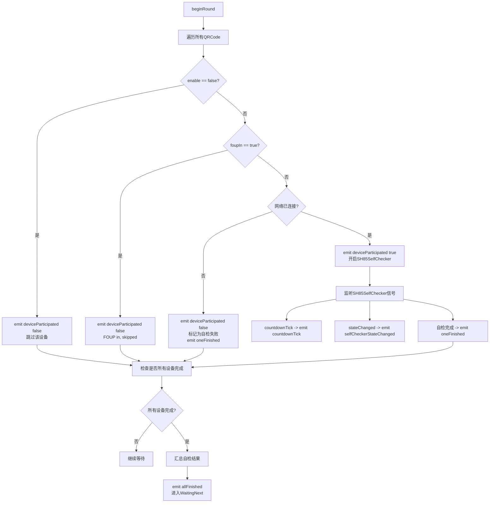
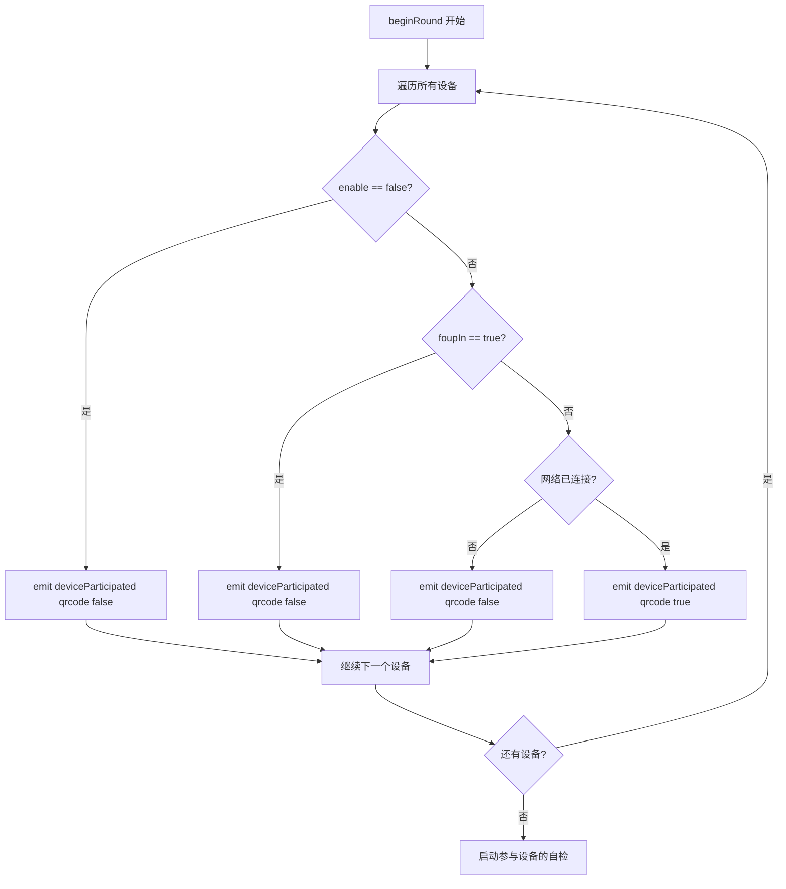
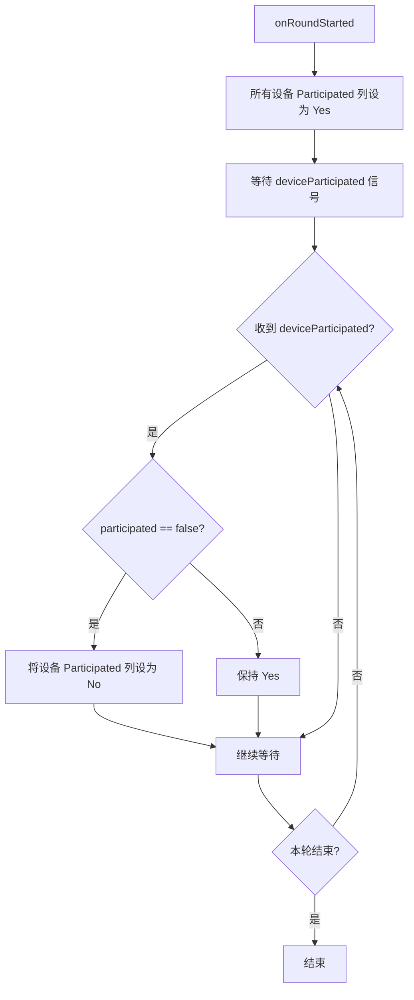

# SH85周期自检实现文档

## 设计思路

SH85周期自检功能是一个定时执行的设备自检系统，核心设计理念如下：

1. **分层架构**：UI层负责参数配置和状态展示，调度层负责任务编排和执行，数据层负责具体自检逻辑
2. **状态驱动**：通过状态机管理自检流程（Stopped、Checking、WaitingNext）
3. **批量处理**：支持多设备并发自检，汇总结果统计
4. **容错机制**：网络未连接设备直接标记为失败，不影响其他设备自检
5. **可配置性**：支持动态开关自检功能、调整自检周期
6. **实时反馈**：通过 deviceParticipated 信号提前通知 UI 设备是否参与本轮

---

## UI界面设计

### 周期SH85自检SettingWidget

#### 组件布局

| 组件 | 类型 | 说明 |
|---|---|---|
| **Item 1** | - | 是否启用周期自检功能 |
| - 启用开关 | ComboBox | 两个选项：true、false |
| **Item 2** | - | 周期自检参数设置 |
| - 时间数值 | SpinBox | 整数类型，设置时间值 |
| - 时间单位 | ComboBox | 选项：s（秒）、min（分钟）、hour（小时） |
| - 设置按钮 | PushButton | 点击后设置自检参数 |
| **Item 3** | - | 自检状态 |
| - 状态显示 | LineEdit | 只读模式，显示周期自检状态 |
| **Item 4** | - | 查看自检报告 |
| - 报告按钮 | PushButton | 点击后打开自检报告模态框 |

#### 自检状态说明（英文化）

| 状态 | 显示内容 | 说明 |
|---|---|---|
| 自检功能未启用 | "Self-check disabled" | 周期自检功能已关闭 |
| 自检中 | "Self-checking (elapsed: Xs)" | 显示自检已花费的时间 |
| 等待下次自检中 | "Waiting for next check (countdown: Xs)" | 显示距离下次自检的倒计时 |

### 自检报告UI设计

#### 模态框结构

- **Tab Widget**：包含两个标签页

##### Tab 1：Live Log

- **滚动窗口**（Scroll Area）
- **80Port自检表格**（QTableView）
  - 表头（英文化）：
    - QRCode：设备二维码
    - Execution Status：自检执行状态
    - Countdown(s)：自检倒计时
    - Success：自检结果（Yes/No）
    - Participated：是否参与本轮自检（Yes/No）
  - **Success 列配色**：
    - 成功：背景 `#32CD32`（Lime Green），字体保持默认
    - 失败：背景 `#DC143C`（Crimson），字体白色
  - **触屏滚动**：启用 `QScroller::LeftMouseButtonGesture` 拖动手势，滚动条 handle 颜色 `#D4D0C8`
  - **Execution Status 单元格**：中文状态映射为英文：
    - "空闲" → "Idle"
    - "下发自检指令中" → "Sending self-check command"
    - "等待 5s（阶段1前）" → "Waiting 5s (before phase 1)"
    - "阶段1读取自检状态中" → "Reading self-check status (phase 1)"
    - "等待 55s（阶段2前）" → "Waiting 55s (before phase 2)"
    - "轮询自检状态中" → "Polling self-check status"
    - "结束" → "Done"

##### Tab 2：History Log

- **滚动窗口**（Scroll Area）
- **自检报告总结表格**（QTableView）
  - 表头（英文化）：
    - Last Check Start Time：自检执行时间
    - Success Count：自检成功的设备数量
    - Failure Count：自检失败的设备数量
    - Participated：未参与自检的设备数量
    - Description：自检总结描述
  - **数据清理策略**：当表格记录数大于1000行时，删除最旧的300条记录
  - **触屏滚动**：与 Live Log 相同的触屏滑动支持

---

## 调度层设计

### 周期SH85自检调度任务（常驻任务）

#### 状态机

```cpp
enum class State {
    Stopped,      // 自检功能未启用
    Checking,     // 自检执行中
    WaitingNext   // 等待下一次自检
};
```

#### 公开方法

| 方法 | 说明 |
|---|---|
| `setEnabled(bool enabled)` | 设置是否开启自检功能 |
| `setPeriod(int value, TimeUnit unit)` | 设置自检周期（每隔多久时间执行一次自检功能） |

#### 信号定义

| 信号 | 说明 | 数据来源 |
|---|---|---|
| `countdownTick(int remainingSeconds, const QString& masterId)` | 反馈自检倒计时 | Master对象的SH85SelfChecker子控件的countdownTick信号 |
| `selfCheckerStateChanged(SH85SelfChecker::State state, const QString& masterId)` | 反馈执行阶段 | Master对象的SH85SelfChecker子控件的stateChanged信号 |
| `oneFinished(const QString& masterId, bool success, const QString& description)` | 上报单个已完成的设备 | 任务内部处理 |
| `allFinished(const SelfCheckSummary& summary)` | 汇总所有设备的自检结果 | 任务内部处理 |
| `deviceParticipated(const QString& qrcode, bool participated)` | 提前通知设备是否参与本轮 | 任务内部在beginRound()中即时发射 |
| `taskStateChanged(State state)` | 反馈任务状态变化 | 任务内部处理 |
| `elapsedTick(int seconds)` | 反馈自检已执行时间 | 任务内部处理 |
| `intervalCountdown(int seconds)` | 反馈距离下次自检倒计时 | 任务内部处理 |

---

## 核心流程

### 自检任务启动流程



### 设备参与状态反馈流程



### UI Participated 列更新流程



---

## 关键算法

### 设备过滤算法（含 FOUP in 过滤）

```cpp
void SH85PeriodicSelfCheckTask::beginRound()
{
    QList<QString> allQRCodes = SharedData::getAllQRCode();
    SelfCheckSummary summary;

    for (const QString& qrcode : allQRCodes) {
        auto* foup = SharedData::getFoupByQRCode(qrcode);
        if (!foup || !foup->enable) {
            // 未启用的设备
            emit deviceParticipated(qrcode, false);
            continue;
        }

        if (foup->foupIn()) {
            // FOUP 在位状态，跳过自检
            emit deviceParticipated(qrcode, false);
            continue;
        }

        auto* master = SharedData::getMasterByQRCode(qrcode);
        if (!master || !master->isConnected()) {
            // 网络未连接，直接标记为失败
            emit deviceParticipated(qrcode, false);
            emit oneFinished(qrcode, false, "Device not connected");
            continue;
        }

        // 参与自检
        emit deviceParticipated(qrcode, true);
        master->selfChecker()->start();
        summary.totalCount++;
    }
}
```

### 历史记录清理策略

```cpp
void SelfCheckReportModel::addRecord(const SelfCheckSummaryRecord& record)
{
    m_records.append(record);

    // 当记录数超过1000时，删除最旧的300条
    if (m_records.size() > 1000) {
        // 删除前300条（最旧的记录）
        for (int i = 0; i < 300 && !m_records.isEmpty(); ++i) {
            m_records.removeFirst();
        }
    }

    // 刷新显示
    refresh();
}
```

### 英文状态映射

```cpp
QString stateText(SH85SelfChecker::State s) {
    const QString cn = SH85SelfChecker::stateToString(s);
    if (cn == QStringLiteral("空闲")) return QStringLiteral("Idle");
    if (cn == QStringLiteral("下发自检指令中")) return QStringLiteral("Sending self-check command");
    if (cn == QStringLiteral("等待 5s（阶段1前）")) return QStringLiteral("Waiting 5s (before phase 1)");
    if (cn == QStringLiteral("阶段1读取自检状态中")) return QStringLiteral("Reading self-check status (phase 1)");
    if (cn == QStringLiteral("等待 55s（阶段2前）")) return QStringLiteral("Waiting 55s (before phase 2)");
    if (cn == QStringLiteral("轮询自检状态中")) return QStringLiteral("Polling self-check status");
    if (cn == QStringLiteral("结束")) return QStringLiteral("Done");
    return cn; // fallback
}
```

---

## 数据结构

### SelfCheckSummary 结构体

```cpp
struct SelfCheckSummary {
    QDateTime startTime;          // 自检开始时间
    QDateTime endTime;            // 自检结束时间
    int successCount;             // 成功设备个数
    int failedCount;              // 失败设备个数
    QList<DeviceResult> details;  // 每个设备的详细结果
};

struct DeviceResult {
    QString qrcode;               // 设备二维码
    bool participated;            // 是否参与本轮自检
    bool success;                 // 是否成功
    QString description;          // 描述信息
};
```

### SelfCheckSummaryRecord 结构体（History Log）

```cpp
struct SelfCheckSummaryRecord {
    QDateTime startTime;          // 自检开始时间
    int successCount;             // 成功设备个数
    int failedCount;              // 失败设备个数
    int participatedCount;        // 参与设备个数
    QString description;          // 自检总结描述
};
```

### LiveLogRecord 结构体（Live Log）

```cpp
struct LiveLogRecord {
    QString qrCode;               // 设备二维码
    QString status;               // 执行状态（英文）
    int countdown;                // 倒计时
    QString success;              // 是否成功（Yes/No）
    QString participated;         // 是否参与（Yes/No）
};
```

### TimeUnit 枚举

```cpp
enum class TimeUnit {
    Second,   // 秒
    Minute,   // 分钟
    Hour      // 小时
};
```

---

## 依赖关系

### 外部依赖

| 依赖项 | 用途 |
|---|---|
| `SchedulerTask` | 基类，提供任务生命周期管理 |
| `SH85SelfChecker` | 设备自检核心逻辑（ModbusTcpMaster的子控件） |
| `FoupOfOHBInfo` | 设备信息结构体（含 foupIn 状态） |
| `ModbusTcpMaster` | 设备通信主控 |
| `SharedData` | 获取设备信息和Master对象 |

### 上层依赖（注册方）

| 组件 | 角色 |
|---|---|
| `SharedData` | 创建并注册任务到调度器，提供全局访问入口 |
| `SH85PeriodicSelfCheckSettingWidget` | UI层，配置自检参数和显示状态 |
| `SH85SelfCheckReportDialog` | UI层，显示自检报告 |

### 下层依赖（消费方）

| 组件 | 角色 |
|---|---|
| `SH85SelfChecker` | 执行具体自检逻辑，发出状态信号 |

---

## 实现细节

### 1. 自检周期计算

```cpp
void SH85PeriodicSelfCheckTask::setPeriod(int value, TimeUnit unit)
{
    qint64 milliseconds = 0;
    switch (unit) {
        case TimeUnit::Second:
            milliseconds = value * 1000;
            break;
        case TimeUnit::Minute:
            milliseconds = value * 60 * 1000;
            break;
        case TimeUnit::Hour:
            milliseconds = value * 60 * 60 * 1000;
            break;
    }
    m_periodMs = milliseconds;
}
```

### 2. 信号转发机制

```cpp
void SH85PeriodicSelfCheckTask::connectSelfChecker(SH85SelfChecker* checker, const QString& masterId)
{
    // 转发 countdownTick 信号
    connect(checker, &SH85SelfChecker::countdownTick,
            this, [this, masterId](int remainingSeconds) {
                emit countdownTick(remainingSeconds, masterId);
            });

    // 转发 stateChanged 信号
    connect(checker, &SH85SelfChecker::stateChanged,
            this, [this, masterId](SH85SelfChecker::State state) {
                emit selfCheckerStateChanged(state, masterId);
            });

    // 监听完成信号
    connect(checker, &SH85SelfChecker::finished,
            this, &SH85PeriodicSelfCheckTask::onOneFinished);
}
```

### 3. 结果汇总算法

```cpp
void SH85PeriodicSelfCheckTask::onAllFinished()
{
    SelfCheckSummary summary;
    summary.startTime = m_roundStartTime;
    summary.endTime = QDateTime::currentDateTime();

    // 统计结果
    for (const auto& result : m_deviceResults) {
        if (result.success) {
            summary.successCount++;
        } else {
            summary.failedCount++;
        }
    }

    // 生成描述
    summary.description = QString("Self-check completed: %1 success, %2 failure, %3 participated")
                            .arg(summary.successCount)
                            .arg(summary.failedCount)
                            .arg(summary.details.size());

    emit allFinished(summary);
}
```

### 4. 触屏滚动实现

```cpp
auto enableTouchScroll = [](QAbstractItemView* view) {
    if (!view) return;
    QScroller::grabGesture(view->viewport(), QScroller::LeftMouseButtonGesture);
    QScroller* scroller = QScroller::scroller(view->viewport());
    QScrollerProperties props = scroller->scrollerProperties();
    props.setScrollMetric(QScrollerProperties::DragStartDistance, 0.005);
    props.setScrollMetric(QScrollerProperties::OvershootDragResistanceFactor, 0.3);
    props.setScrollMetric(QScrollerProperties::OvershootScrollDistanceFactor, 0.1);
    scroller->setScrollerProperties(props);
    // 滚动条 handle 默认即为 hover 色
    const QString scrollHandleStyle =
        "QScrollBar::handle:vertical{background:#D4D0C8;}"
        "QScrollBar::handle:horizontal{background:#D4D0C8;}";
    view->setStyleSheet(view->styleSheet() + scrollHandleStyle);
};
```

---

## 日志增强

### TX/RX 原始帧日志

在 `SH85SelfChecker::onCommandFinished()` 中，无论响应成功（INFO）还是失败（WARN），日志均追加请求与响应的原始字节：

```cpp
inline QString frameToHex(const ModbusFrame& f)
{
    QByteArray bytes = f.rawBytes;
    bytes.append(f.crc);
    return QString::fromLatin1(bytes.toHex(' ').toUpper());
}

void SH85SelfChecker::onCommandFinished(ModbusCommand cmd, const QString& masterId)
{
    // ... 前置检查 ...

    const bool ok = cmd.received && !cmd.timedOut && !cmd.checksumError && !cmd.deviceBusy;

    const QString txHex = frameToHex(cmd.request);
    const QString rxHex = frameToHex(cmd.response);

    LoggerManager::instance().log(masterLogPath(masterId).toStdString(),
        ok ? Level::INFO : Level::WARN,
        QString("[data][SH85SelfChecker] 响应 state=%1 ok=%2 id=%3 masterId=%4\nTX：%5\nRX：%6")
            .arg(stateToString(m_state)).arg(ok).arg(cmd.id).arg(masterId)
            .arg(txHex).arg(rxHex).toStdString());

    // ... 状态机处理 ...
}
```

---

## 通讯记录器（CommunicationRecorder）

### 节流策略

`CommunicationRecorder` 仅对特定高频指令进行节流，其他指令全量发射：

- **节流目标指令**：`THROTTLED_COMMAND_ID = "ReadFoupStatus"`（FOUP 属性查询指令）
- **节流阈值**：
  - FOUP in 状态：1000ms（1s）
  - FOUP out 状态：3000ms（3s）
- **其他指令**：在 `submitCommand()` 中立即 `emit shouldEmit`，不参与节流

### 实现逻辑

```cpp
void CommunicationRecorder::submitCommand(const ModbusCommand& cmd, const QString& masterId)
{
    if (masterId.isEmpty()) return;
    if (cmd.responseMs - cmd.sentMs <= 0) return;

    // 仅对节流目标指令进行节流，其他指令全量发射
    if (cmd.id != QLatin1String(THROTTLED_COMMAND_ID)) {
        emit shouldEmit(cmd, masterId);
        return;
    }

    // 节流目标指令：存储最新指令并累计计时
    m_latestCmd[masterId] = cmd;
    if (!m_counterMs.contains(masterId)) {
        m_counterMs[masterId] = 0;
    }
}
```

---

## 文件位置

| 文件 | 路径 |
|---|---|
| 调度任务头文件 | `OHB80PortMonitor_V_1_0_0/scheduler/tasks/sh85_periodic_self_check_task.h` |
| 调度任务实现文件 | `OHB80PortMonitor_V_1_0_0/scheduler/tasks/sh85_periodic_self_check_task.cpp` |
| UI设置Widget头文件 | `OHB80PortMonitor_V_1_0_0/ui/customwidget/configsettingwidget/sh85periodicselfchecksettingwidget.h` |
| UI设置Widget实现文件 | `OHB80PortMonitor_V_1_0_0/ui/customwidget/configsettingwidget/sh85periodicselfchecksettingwidget.cpp` |
| 自检报告Dialog头文件 | `OHB80PortMonitor_V_1_0_0/ui/customwidget/configsettingwidget/sh85selfcheckreportdialog.h` |
| 自检报告Dialog实现文件 | `OHB80PortMonitor_V_1_0_0/ui/customwidget/configsettingwidget/sh85selfcheckreportdialog.cpp` |
| 自检检查器头文件 | `OHB80PortMonitor_V_1_0_0/data/modbustcpmastermanager/modbustcpmaster/sh85selfchecker.h` |
| 自检检查器实现文件 | `OHB80PortMonitor_V_1_0_0/data/modbustcpmastermanager/modbustcpmaster/sh85selfchecker.cpp` |
| 通讯记录器头文件 | `OHB80PortMonitor_V_1_0_0/tool/communicationrecorder/communicationrecorder.h` |
| 通讯记录器实现文件 | `OHB80PortMonitor_V_1_0_0/tool/communicationrecorder/communicationrecorder.cpp` |
| Modbus配置文件 | `OHB80PortMonitor_V_1_0_0/bin/config/ModbusTcpMasterConfig.xml` |
| 实现文档 | `OHB80PortMonitor_V_1_0_0/docs/realize/sh85_periodic_self_check.md` |
