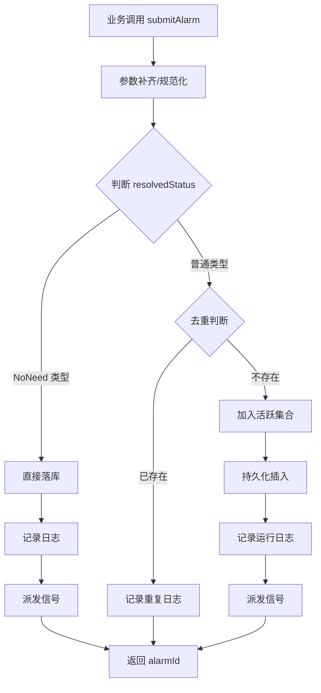
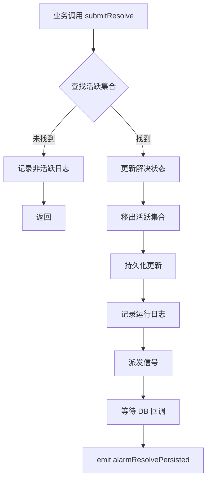
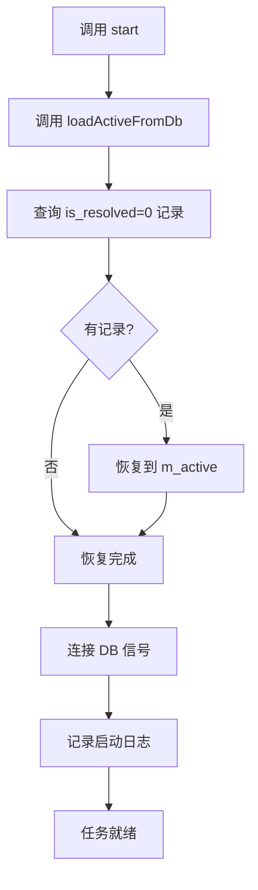

# AlarmDispatchTask 功能文档

## 1. 功能概述

AlarmDispatchTask 是一个常驻的警报调度任务，负责系统内警报的生命周期管理。它取代了原有的 AlarmLogicSystem，提供更完善的警报处理机制。

### 核心职责
- **警报提交**：接收业务侧提交的警报事件，进行去重、持久化和派发
- **警报解决**：接收警报解决请求，更新活跃状态并持久化
- **去重管理**：通过 alarmId 字符串进行警报去重，避免重复处理
- **持久化**：将警报事件写入 alarm_log 数据库表
- **事件派发**：通过信号机制通知 UI 层和其他订阅者

### 数据载体
使用 `AlarmInfo` 结构体（与 alarm_log 表字段对齐），alarmId 生成规则：
```
alarmId = level(1位) + sourceIdentifier(5位) + type(4位)
```

---

## 2. 功能实现逻辑

### 2.1 警报提交流程

#### 简化提交接口
```cpp
QString submitAlarm(int alarmType, int alarmSource, 
                    const QString& sourceIdentifier, 
                    const QString& description);
```

**处理步骤**：
1. **参数补齐**：根据 alarmType 自动推导 alarmLevel，生成 alarmId
2. **去重判断**：
   - 检查 alarmId 是否在活跃集合 `m_active` 中
   - 若已存在，记录日志并忽略
3. **分类处理**：
   - **NoNeed 类型**（如 SH85 自检报警）：直接落库，不参与活跃跟踪
   - **普通类型**：加入活跃集合，进行后续跟踪
4. **持久化**：调用 `persistInsert()` 写入 alarm_log 表
5. **运行日志**：根据告警级别调用 `OperationDispatchTask` 的日志方法
6. **事件派发**：emit `alarmPublished` 信号通知订阅者

#### 完整提交接口
```cpp
QString submitAlarm(AlarmInfo info);
```

**处理步骤**：
1. **数据规范化**：调用 `normalize()` 补齐默认字段
2. 后续流程与简化提交接口相同

### 2.2 警报解决流程

#### 按 alarmId 解决
```cpp
void submitResolve(const QString& alarmId);
```

**处理步骤**：
1. **查找警报**：在活跃集合中查找指定 alarmId
2. **状态更新**：设置 `isResolved=1`，记录当前时间到 `resolveTime`
3. **移除活跃**：从 `m_active` 中删除该警报
4. **持久化**：调用 `persistResolve()` 更新数据库
5. **运行日志**：记录解决信息
6. **事件派发**：emit `alarmResolved` 信号

#### 按参数解决
```cpp
void submitResolve(int alarmType, int alarmSource, 
                   const QString& sourceIdentifier);
```

内部生成 alarmId 后转发到按 alarmId 解决的流程。

### 2.3 启动恢复流程

```cpp
void loadActiveFromDb();
```

**处理步骤**：
1. 查询 alarm_log 表中所有 `is_resolved=0` 的记录
2. 将记录恢复到 `m_active` 活跃集合
3. 确保程序重启后能继续监控未解决的警报

### 2.4 数据库持久化

#### 插入持久化
```cpp
void persistInsert(const AlarmInfo& info);
```
- 调用 `AlarmLogDBCon::insertRecord()` 异步写入
- 写入完成后 emit `alarmLogInserted` 信号

#### 解决持久化
```cpp
void persistResolve(const AlarmInfo& info);
```
- 调用 `AlarmLogDBCon::updateResolve()` 更新记录
- 监听 `recordResolved` 信号
- 收到信号后查询完整记录并 emit `alarmResolvePersisted` 信号

---

## 3. 实现逻辑流程图

### 3.1 警报提交流程图



### 3.2 警报解决流程图



### 3.3 启动恢复流程图



---

## 4. 日志调试记录介绍

### 4.1 日志路径
```
scheduler/alarm_dispatch_task
```

### 4.2 关键日志节点

#### 构造日志
```
[INFO] [AlarmDispatchTask] 警报调度任务已构造
```

#### 启动日志
```
[INFO] [start] 警报调度任务已启动，活跃警报数=N
```

#### 停止日志
```
[INFO] [stop] 警报调度任务已停止
```

#### 警报提交日志

**NoNeed 类型**：
```
[INFO] [submitAlarm] 提交警报(无需解决): 警报ID=xxx, 类型=xxx, 设备标识=xxx, 描述=xxx
```

**重复警报**：
```
[INFO] [submitAlarm] 提交警报(重复，已忽略): 警报ID=xxx, 类型=xxx, 级别=xxx, 设备标识=xxx, 描述=xxx
```

**正常提交**：
```
[INFO] [submitAlarm] 提交警报: 警报ID=xxx, 类型=xxx, 级别=xxx, 设备标识=xxx, 描述=xxx
```

#### 警报解决日志

**非活跃警报**：
```
[WARN] [submitResolve] 提交解决(非活跃): 警报ID=xxx
```

**正常解决**：
```
[INFO] [submitResolve] 提交解决: 警报ID=xxx, 类型=xxx, 设备标识=xxx, 解决时间=xxx
```

#### 持久化日志

**插入持久化**：
```
[INFO] [persistInsert] 持久化插入: 警报ID=xxx, 级别=xxx, 类型=xxx
```

**解决持久化**：
```
[INFO] [persistResolve] 持久化更新: 警报ID=xxx, 设备标识=xxx, 类型=xxx, 解决时间=xxx
```

**数据库不可用**：
```
[ERROR] [persistInsert] 警报日志数据库不可用，丢弃警报: xxx
[ERROR] [persistResolve] 警报日志数据库不可用，跳过解决: xxx
```

#### 数据库恢复日志
```
[INFO] [loadActiveFromDb] 从数据库恢复 N 条未解决警报
```

#### 数据库回调日志

**未找到记录**：
```
[WARN] [onAlarmDBRecordResolved] 数据库写入后未找到解决记录: 设备标识=xxx, 类型=xxx, 解决时间=xxx
```

**未匹配记录**：
```
[WARN] [onAlarmDBRecordResolved] 未找到匹配解决时间的记录: 设备标识=xxx, 类型=xxx, 解决时间=xxx
```

### 4.3 日志调试要点

1. **去重验证**：通过重复警报日志验证去重逻辑是否正常
2. **持久化验证**：通过持久化日志确认数据库写入状态
3. **恢复验证**：通过恢复日志验证程序重启后状态恢复
4. **异常排查**：数据库不可用日志用于排查连接问题
5. **时序分析**：通过时间戳分析警报提交到派发的时序

### 4.4 Defer 机制

所有关键方法都使用 `Tool::Defer` 确保函数退出时自动刷新日志，保证日志及时写入磁盘：
```cpp
Tool::Defer defer([]() {
    LoggerManager::instance().flush(LOG_PATH);
});
```

---

## 5. 使用示例

### 5.1 提交警报
```cpp
auto* task = SharedData::getAlarmDispatchTask();
QString alarmId = task->submitAlarm(
    static_cast<int>(AlarmType::DeviceOffline),
    static_cast<int>(AlarmSource::Device),
    qrCode,
    QStringLiteral("Device %1 connection lost").arg(qrCode));
```

### 5.2 解决警报
```cpp
task->submitResolve(
    static_cast<int>(AlarmType::DeviceOffline),
    static_cast<int>(AlarmSource::Device),
    qrCode);
```

### 5.3 UI 订阅
```cpp
connect(task, &AlarmDispatchTask::alarmPublished,
        this, &MyWidget::onAlarmPublished);
connect(task, &AlarmDispatchTask::alarmResolved,
        this, &MyWidget::onAlarmResolved);
```

---

## 6. 注意事项

1. **线程安全**：所有公共接口都是线程安全的，使用 QMutex 保护
2. **常驻任务**：`isPersistent()` 返回 true，不会被调度器自动停止
3. **去重规则**：基于 alarmId 字符串，确保相同警报不会重复处理
4. **异步持久化**：数据库操作通过 QueuedConnection 异步执行，不影响主线程
5. **日志刷新**：使用 Defer 机制确保日志及时写入，避免丢失
