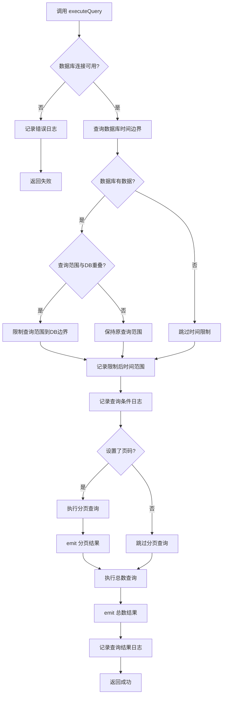
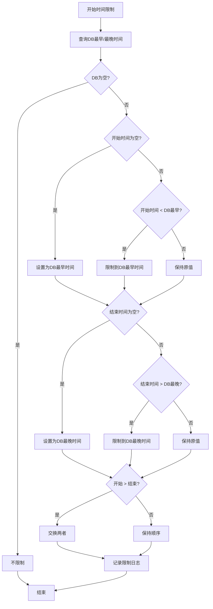

# AlarmLogQueryTask 功能文档

## 1. 功能概述

AlarmLogQueryTask 是一个警报日志查询任务，负责从 alarm_log 数据库表中查询符合条件的警报记录，支持多条件组合查询和分页功能。

### 核心职责
- **条件查询**：支持按告警级别、设备标识、告警类型、是否解决、时间范围等多个条件组合查询
- **分页查询**：支持分页获取符合条件的记录
- **总数统计**：查询符合条件的记录总数
- **时间范围限制**：自动将查询时间范围限制在数据库实际时间范围内，避免无效查询
- **结果派发**：通过信号机制将查询结果传递给订阅者

### 数据载体
使用 `AlarmRecord` 结构体（与 alarm_log 表字段对齐）

---

## 2. 功能实现逻辑

### 2.1 查询条件设置

提供了多个设置接口，所有条件都是可选的，未设置的条件不生效：

```cpp
void setPageNumber(int pageNumber);      // 页码，1-based
void setPageSize(int pageSize);          // 每页大小，默认500
void setAlarmLevel(int alarmLevel);      // 告警级别，-1 表示未设置
void setQRCode(const QString& qrCode);  // 设备标识，空字符串表示未设置
void setAlarmType(const QString& alarmType);  // 告警类型，空字符串表示未设置
void setIsResolved(int isResolved);      // 是否解决，-1 表示未设置
void setOccurTimeRange(const QString& startTime, const QString& endTime);  // 时间范围
```

### 2.2 查询执行流程

```cpp
void executeQuery();
```

**处理步骤**：

1. **数据库连接检查**
   - 检查数据库连接是否可用
   - 不可用时记录错误日志并返回

2. **时间范围限制**
   - 查询数据库的最早和最晚时间
   - 如果查询范围为空，用数据库边界补齐
   - 如果查询范围超出数据库边界，限制到数据库边界
   - 如果查询范围与数据库范围无重叠，保持原值（SQL 自然返回空集）
   - 记录限制前后的时间范围日志

3. **记录查询条件**
   - 将所有查询条件记录到日志，便于调试

4. **执行分页查询**
   - 如果设置了页码（pageNumber > 0），执行分页查询
   - 返回当前页的记录列表
   - emit `pageWithConditionsResult` 信号

5. **执行总数查询**
   - 查询符合条件的总记录数
   - emit `totalCountWithConditionsResult` 信号

6. **记录查询结果**
   - 记录总记录数、当前页记录数、页码、每页大小
   - 记录查询成功状态

### 2.3 时间范围限制逻辑

时间范围限制的目的是避免查询超出数据库实际范围的数据，提高查询效率。

**限制规则**：
- 开始时间为空 → 使用数据库最早时间
- 结束时间为空 → 使用数据库最晚时间
- 开始时间早于数据库最早时间 → 限制到数据库最早时间
- 结束时间晚于数据库最晚时间 → 限制到数据库最晚时间
- 开始时间晚于结束时间 → 交换两者
- 查询范围与数据库范围无重叠 → 保持原值（SQL 返回空集）

---

## 3. 实现逻辑流程图

### 3.1 查询执行流程图



### 3.2 时间范围限制流程图



---

## 4. 日志调试记录介绍

### 4.1 日志路径
```
scheduler/alarm_log_query_task
```

### 4.2 关键日志节点

#### 构造日志
```
[INFO] [AlarmLogQueryTask] 警报日志查询任务已构造
```

#### 启动日志
```
[INFO] [start] 警报日志查询任务已启动
```

#### 数据库不可用日志
```
[ERROR] [start] 警报日志数据库不可用
[ERROR] [executeQuery] 数据库连接不可用
```

#### 时间范围限制日志

**限制后时间范围**：
```
[INFO] [executeQuery] 限制后时间范围: 2026-05-14 18:25:29 -> 2026-05-19 17:21:58 (数据库: 2026-05-14 18:25:29 -> 2026-05-19 17:21:58)
```

**无重叠不限制**：
```
[INFO] [executeQuery] 请求窗口与数据库范围无重叠，不限制: 2026-01-01 00:00:00 -> 2026-01-01 23:59:59 (数据库: 2026-05-14 18:25:29 -> 2026-05-19 17:21:58)
```

#### 查询条件日志
```
[INFO] [executeQuery] 查询条件: alarmLevel(告警级别)=全部, qrCode(设备标识)=全部, alarmType(告警类型)=全部, isResolved(是否解决)=全部, occurTime(时间范围)=2026-05-14 18:25:29 -> 2026-05-19 17:21:58
```

#### 查询结果日志
```
[INFO] [executeQuery] 查询成功: 总记录数=150, 当前页记录数=50, 页码=1, 每页大小=500
```

#### 查询完成日志
```
[INFO] [executeQuery] 查询完成
```

### 4.3 日志调试要点

1. **条件验证**：通过查询条件日志验证条件设置是否正确
2. **时间范围验证**：通过时间范围限制日志验证查询范围是否合理
3. **结果验证**：通过查询结果日志验证查询结果是否符合预期
4. **性能分析**：通过时间戳分析查询耗时
5. **异常排查**：数据库不可用日志用于排查连接问题

### 4.4 日志格式说明

查询条件日志采用 `英文字段名(中文说明)=值` 的格式：
- `alarmLevel(告警级别)`：告警级别，-1 表示全部
- `qrCode(设备标识)`：设备标识，空字符串表示全部
- `alarmType(告警类型)`：告警类型，空字符串表示全部
- `isResolved(是否解决)`：是否解决，-1 表示全部，0 表示未解决，1 表示已解决
- `occurTime(时间范围)`：发生时间范围，空字符串表示不限

### 4.5 Defer 机制

所有关键方法都使用 `Tool::Defer` 确保函数退出时自动刷新日志，保证日志及时写入磁盘：
```cpp
Tool::Defer defer([]() {
    LoggerManager::instance().flush(LOG_PATH);
});
```

---

## 5. 使用示例

### 5.1 基本查询
```cpp
auto* task = new AlarmLogQueryTask();
task->setPageNumber(1);
task->setPageSize(100);
task->start();

// 订阅结果
connect(task, &AlarmLogQueryTask::pageWithConditionsResult,
        this, &MyWidget::onPageResult);
connect(task, &AlarmLogQueryTask::totalCountWithConditionsResult,
        this, &MyWidget::onTotalCount);
```

### 5.2 条件查询
```cpp
auto* task = new AlarmLogQueryTask();
task->setPageNumber(1);
task->setPageSize(50);
task->setAlarmLevel(2);  // 查询 Error 级别
task->setQRCode("DEVICE001");
task->setIsResolved(0);  // 查询未解决
task->setOccurTimeRange("2026-05-01 00:00:00", "2026-05-31 23:59:59");
task->start();
```

### 5.3 查询所有记录
```cpp
auto* task = new AlarmLogQueryTask();
task->setPageNumber(1);
task->setPageSize(1000);  // 设置较大页数
// 不设置其他条件，查询所有记录
task->start();
```

---

## 6. 注意事项

1. **线程安全**：查询操作在任务线程中执行，信号使用 QueuedConnection 发送
2. **数据库连接**：每次查询前检查数据库连接，连接不可用时返回错误
3. **时间范围限制**：自动限制查询范围，避免无效查询，提高效率
4. **异步执行**：查询结果通过信号异步传递，不阻塞调用线程
5. **日志刷新**：使用 Defer 机制确保日志及时写入，避免丢失
6. **分页参数**：pageNumber 从 1 开始，0 表示未设置
7. **条件组合**：所有条件都是可选的，未设置的条件不生效
8. **空值处理**：空字符串表示条件未设置，不参与查询条件

---

## 7. 性能优化建议

1. **合理设置页大小**：根据实际需求设置合适的 pageSize，避免一次查询过多数据
2. **利用时间范围**：尽量设置合理的时间范围，减少查询数据量
3. **索引优化**：确保数据库表在常用查询字段上有适当的索引
4. **避免全表扫描**：设置至少一个查询条件，避免全表扫描
5. **缓存结果**：对于不常变化的数据，可以考虑在应用层缓存查询结果
