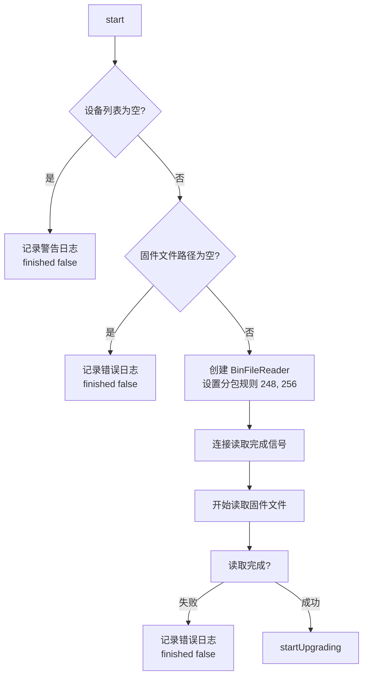
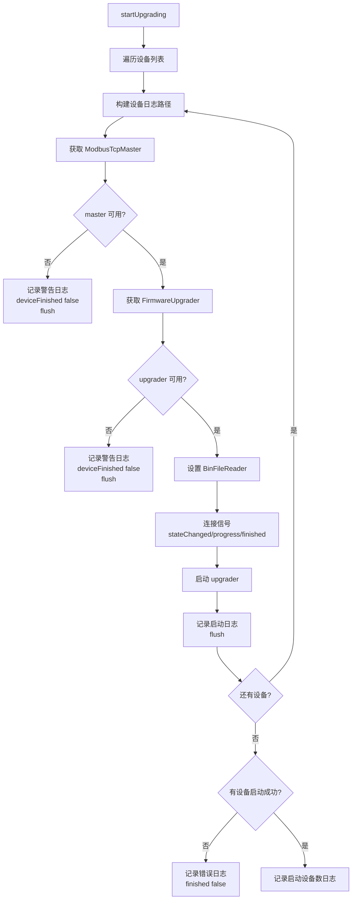
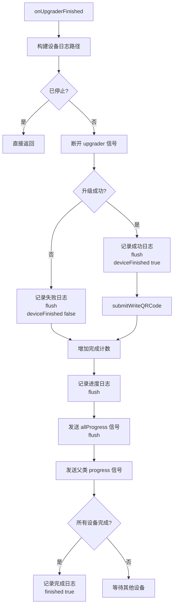
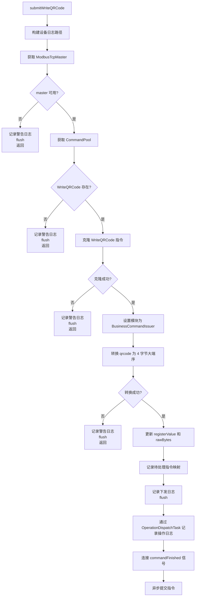

# FirmwareUpgradeTask 功能文档

## 1. 功能概述

FirmwareUpgradeTask 是一个用于批量升级设备固件的调度任务。该任务负责：

- 支持同时升级多个设备的固件
- 读取固件文件（.bin）并按分包规则处理：第一帧248字节（含帧头），后续帧256字节（不含帧头）
- 为每个设备启动独立的升级流程
- 实时报告单个设备的升级进度和状态
- 固件升级成功后自动补发 WriteQRCode 指令以恢复设备标识
- 支持任务取消和停止操作
- 提供总体进度反馈（已完成设备数/总设备数）

**日志特性**：
- 基础日志路径：`scheduler/firmware_upgrade_task`
- 每个设备有独立的日志文件：`scheduler/firmware_upgrade_task/{qrcode}`
- 例如：设备 12001 的日志文件为 `scheduler/firmware_upgrade_task/12001`

## 2. 执行过程描述

### 2.1 任务启动流程

1. 任务通过 `start()` 方法启动
2. 验证设备列表非空，固件文件路径非空
3. 创建 BinFileReader，设置分包规则 {248, 256}
4. 连接 BinFileReader 的读取完成信号
5. 开始读取固件文件
6. 读取完成后，调用 `startUpgrading()` 开始升级流程

### 2.2 设备升级流程

1. 遍历待升级设备列表
2. 为每个设备构建设备专属日志路径
3. 获取设备的 ModbusTcpMaster 和 FirmwareUpgrader 实例
4. 设置共享的 BinFileReader
5. 连接 upgrader 的信号（stateChanged、progress、finished）
6. 调用 upgrader->start() 启动升级
7. 记录升级启动日志并刷新
8. 检查是否有设备成功启动

### 2.3 单设备升级完成流程

1. 接收到设备的升级完成信号
2. 断开该 upgrader 的信号连接
3. 记录升级结果日志（成功/失败）
4. 转发 deviceFinished 信号给 UI 层
5. 如果升级成功，调用 `submitWriteQRCode()` 补发 QRCode 指令
6. 增加完成计数，记录进度日志
7. 发送 allProgress 信号并刷新日志
8. 发送父类 progress 信号
9. 如果所有设备完成，标记任务完成

### 2.4 WriteQRCode 补发流程

1. 获取设备的 ModbusTcpMaster 和 CommandPool
2. 验证 WriteQRCode 指令存在
3. 克隆 WriteQRCode 指令
4. 将 qrcode 转换为 4 字节大端序数据
5. 更新指令的 registerValue 和 rawBytes
6. 记录待处理指令映射
7. 记录下发日志并刷新
8. 通过 OperationDispatchTask 记录操作日志
9. 连接 commandFinished 信号
10. 异步提交指令

### 2.5 WriteQRCode 响应处理流程

1. 接收到 WriteQRCode 指令响应
2. 验证是否为关注的指令
3. 写入通讯日志数据库
4. 记录指令执行结果日志（成功/失败）
5. 刷新日志到磁盘

### 2.6 任务停止流程

1. 设置停止标志
2. 停止所有正在运行的 upgrader
3. 断开所有 WriteQRCode 信号连接
4. 标记任务为 Cancelled
5. 发送 finished(false) 信号

## 3. 流程图

### 3.1 任务启动流程

### 3.2 设备升级流程

### 3.3 单设备升级完成流程

### 3.4 WriteQRCode 补发流程

## 4. 日志调试记录

### 4.1 日志路径设计

- **基础日志路径**：`scheduler/firmware_upgrade_task`
  - 用于任务级别的日志（构造、启动、停止、文件读取等）
  
- **设备专属日志路径**：`scheduler/firmware_upgrade_task/{qrcode}`
  - 每个设备有独立的日志文件
  - 用于设备级别的日志（升级状态、进度、WriteQRCode 指令等）
  - 例如：设备 12001 的日志文件为 `scheduler/firmware_upgrade_task/12001`

### 4.2 主要日志记录点

| 记录点 | 日志内容 | 日志级别 | 日志路径 |
|--------|----------|----------|----------|
| 构造函数 | 固件升级任务已构造 | INFO | 基础路径 |
| start | 固件升级任务启动 | INFO | 基础路径 |
| start | 开始读取固件文件: {binFilePath} | INFO | 基础路径 |
| start | 没有待升级的设备 | WARN | 基础路径 |
| start | 未指定固件文件路径 | ERROR | 基础路径 |
| onBinFileReadFinished | 读取固件文件失败: {errorMsg} | ERROR | 基础路径 |
| onBinFileReadFinished | 固件文件读取成功，开始升级 | INFO | 基础路径 |
| startUpgrading | 设备 {deviceId} 不存在 | WARN | 设备专属 |
| startUpgrading | 设备 {deviceId} 固件升级子模块不可用 | WARN | 设备专属 |
| startUpgrading | 启动设备升级: {deviceId} | INFO | 设备专属 |
| startUpgrading | 所有设备均无法启动固件升级 | ERROR | 基础路径 |
| startUpgrading | 共启动 {count} 台设备升级 | INFO | 基础路径 |
| onUpgraderStateChanged | 设备={masterId}, 状态={state}, 消息={logMessage} | INFO | 设备专属 |
| onUpgraderFinished | [{masterId}] 固件升级成功 | INFO | 设备专属 |
| onUpgraderFinished | [{masterId}] 固件升级失败: {errorMessage} | ERROR | 设备专属 |
| onUpgraderFinished | 进度: {finishedCount}/{totalCount} | INFO | 设备专属 |
| onUpgraderFinished | 固件升级全部完成，共 {totalCount} 台设备 | INFO | 基础路径 |
| submitWriteQRCode | 下发 WriteQRCode 失败 | WARN | 设备专属 |
| submitWriteQRCode | 下发 WriteQRCode masterId={masterId} value={qrcodeValue} | INFO | 设备专属 |
| onWriteQRCodeFinished | WriteQRCode 指令成功 | INFO | 设备专属 |
| onWriteQRCodeFinished | WriteQRCode 指令失败 | WARN | 设备专属 |
| stop | 停止固件升级任务 | INFO | 基础路径 |

### 4.3 调试

1. **查看任务级别日志**：检查 `scheduler/firmware_upgrade_task` 日志文件，了解任务整体执行情况
2. **查看设备专属日志**：检查 `scheduler/firmware_upgrade_task/{qrcode}` 日志文件，了解特定设备的升级详情
3. **固件文件读取失败**：检查文件路径、文件格式、文件权限
4. **设备升级失败**：检查设备连接、网络状态、设备响应
5. **WriteQRCode 指令失败**：检查指令配置、设备状态、通讯日志数据库
