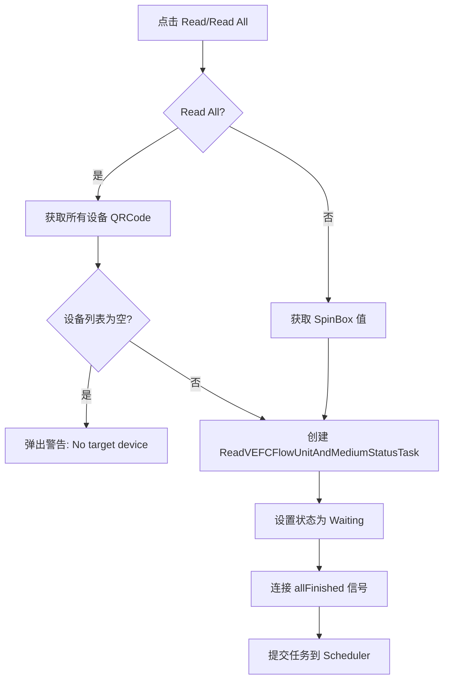
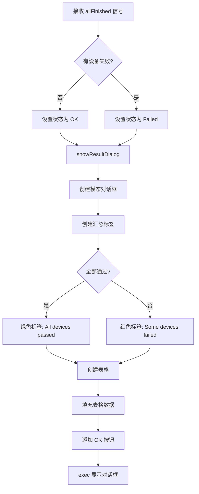

# VEFCFlowUnitMediumStatusWidget 功能文档

## 1. 功能概述

VEFCFlowUnitMediumStatusWidget 是一个用于读取 VEFC 流量单位和介质配置状态的调试界面组件。该组件提供：

- 指定单个设备 QRCode 进行读取
- 批量读取所有设备的配置状态
- 使用模态对话框表格显示读取结果
- 可视化展示每个设备的通信、单位、介质状态

**底层指令**：ReadVEFCFlowUnitAndMediumStatus（FC 0x04, addr 0x0011）

**响应格式**：2 字节寄存器
- hi_byte: 0=单位配置成功 / 1=单位配置失败（默认 L/Min）
- lo_byte: 0=介质配置成功 / 1=介质配置失败（默认 CDA）

## 2. 界面组成

### 2.1 Target Device 输入框

- **类型**：QSpinBox
- **范围**：0~99999
- **默认值**：第一个设备的 QRCode
- **用途**：指定 Read 按钮的目标设备

### 2.2 Read 按钮

- **功能**：读取 SpinBox 中指定的单个设备
- **触发**：onReadBtnClicked()
- **流程**：
  1. 获取 SpinBox 值
  2. 转换为字符串
  3. 调用 submitTask({qrcode})

### 2.3 Read All 按钮

- **功能**：读取所有设备
- **触发**：onReadAllBtnClicked()
- **流程**：
  1. 获取 SharedData::getAllQrcodes()
  2. 检查是否为空，若为空则弹出警告
  3. 调用 submitTask(qrcodes)

## 3. 执行流程

### 3.1 任务提交流程

### 3.2 结果显示流程

## 4. 结果对话框设计

### 4.1 汇总标签

- **全部通过**：绿色粗体，显示 "All N device(s) passed: Unit OK + Medium OK"
- **有失败**：红色粗体，显示 "N/M device(s) passed, K failed."

### 4.2 表格列

| 列名 | 说明 | 颜色 |
|------|------|------|
| QRCode | 设备标识 | 默认 |
| 通信 | 成功/失败 | 成功绿色/失败红色 |
| 单位 | 成功/失败/- | 成功绿色/失败红色/灰色(-) |
| 介质 | 成功/失败/- | 成功绿色/失败红色/灰色(-) |

### 4.3 表格行为

- 不可编辑
- 整行选择
- 列宽自动拉伸
- 通信失败时，单位和介质显示 "-"（灰色）

## 5. 日志记录

任务提交时记录日志：
- 日志路径：系统日志路径
- 日志内容：`[ui][VEFCFlowUnitMediumStatusWidget][submitTask]：提交任务 设备数=N`
- 日志级别：INFO

## 6. 依赖关系

- **任务依赖**：ReadVEFCFlowUnitAndMediumStatusTask
- **数据依赖**：SharedData::getAllQrcodes()
- **调度器**：Scheduler

## 7. 使用场景

该组件主要用于调试和测试场景：
- 验证 VEFC 设备的流量单位配置是否正确
- 验证 VEFC 设备的介质配置是否正确
- 批量检查所有设备的配置状态
- 快速定位配置失败的设备
