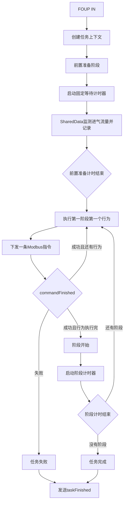

# FOUP IN 分阶段充气调度任务设计

## 1. 文档目的

本文档定义 FOUP IN 后分阶段充气普通调度任务的业务流程、数据结构、状态机、指令执行规则和异常处理边界。

任务根据用户提供的阶段配置，在 FOUP IN 后先等待设备完成预设的抽真空阶段，再按照阶段顺序逐步修改进气流量并持续指定时间。

## 2. 设计范围

本任务包含以下内容：

- FOUP IN 后的抽真空前置准备阶段
- 通过 `SharedData` 监测对应设备的进气流量
- 多个充气阶段的顺序执行
- 每个阶段内多个行为的顺序执行
- 一个行为对应一条 Modbus 指令
- 阶段持续时间计时
- 指令成功、失败和重试结果处理
- 任务完成、取消和 FOUP OUT 处理

本任务不负责实现底层 Modbus 指令发送、重试和响应超时逻辑，这部分由 `ModbusCommandSender` 负责。

## 3. 核心业务规则

### 3.1 任务总持续时间

任务不单独配置总持续时间。

充气任务的总持续时间由所有充气阶段的持续时间累加得到：

```text
充气任务总持续时间 = 阶段1持续时间 + 阶段2持续时间 + ... + 阶段N持续时间
```

抽真空前置准备阶段的等待时间不计入充气阶段总持续时间。

### 3.2 抽真空前置准备阶段

FOUP IN 后，设备首先处于抽真空阶段。该阶段没有充气流量，也不执行用户配置的充气行为。

前置准备阶段的规则如下：

- 进入 FOUP IN 任务后立即开始前置准备计时
- 通过 `SharedData` 获取并记录对应设备的进气流量
- 进气流量仅用于监测、日志和 UI 展示
- 不根据进气流量判断抽真空异常
- 不根据进气流量提前结束前置准备阶段
- 前置准备计时结束后，无论当前监测值如何，都直接进入第一个充气阶段
- 前置准备时间结束不是异常超时，不生成失败结论

因此，前置准备阶段本质上是一个固定等待阶段，而不是异常检测阶段。

### 3.3 阶段和行为执行规则

- 阶段按照配置列表顺序执行
- 一个阶段内的行为按照配置列表顺序执行
- 每个行为只对应一条 Modbus 指令
- 当前行为指令成功后，才允许执行下一个行为
- 当前阶段所有行为都成功后，才启动该阶段的持续时间计时器
- 任意行为指令最终失败，任务立即失败
- 指令重试由 `ModbusCommandSender` 完成，调度任务只等待最终结果

### 3.4 调度任务与阶段执行器职责

为了避免调度任务同时承担流程编排和底层指令执行，采用两层职责划分：

| 组件 | 负责内容 |
|---|---|
| `FoupInStagedChargingTask` | 前置准备计时、阶段索引、阶段切换、阶段持续时间计时、任务生命周期和任务结果 |
| `FoupInStagedChargingStageExecutor` | 当前阶段的行为索引、行为串行执行、Modbus 指令构建、指令响应匹配和重试通知 |
| `foup_in_staged_charging_task_types.h` | 任务、阶段、行为和前置准备配置数据结构，以及计时用途枚举 |

阶段执行器只负责一个阶段。当前阶段的所有行为完成后，执行器向调度任务发送阶段执行结果；调度任务收到成功结果后再启动阶段持续时间计时器。

## 4. 基础数据结构

### 4.1 充气任务

```cpp
struct ChargingTask
{
    QString taskName;
    VacuumPreparation preparation;
    QVector<ChargingStage> stages;
};
```

字段说明：

| 字段 | 类型 | 说明 |
|---|---|---|
| `taskName` | `QString` | 任务名称 |
| `preparation` | `VacuumPreparation` | 抽真空前置准备配置 |
| `stages` | `QVector<ChargingStage>` | 充气阶段列表 |

### 4.2 前置准备配置

```cpp
struct VacuumPreparation
{
    int durationSeconds = 0;
};
```

`durationSeconds` 表示 FOUP IN 后等待抽真空阶段的固定时间。该时间到达后直接执行第一个充气阶段，不作为失败超时时间使用。

### 4.3 充气阶段

```cpp
struct ChargingStage
{
    QString stageName;
    int durationSeconds = 0;
    QVector<ChargingBehavior> behaviors;
};
```

字段说明：

| 字段 | 类型 | 说明 |
|---|---|---|
| `stageName` | `QString` | 阶段名称，用于日志、UI 和状态显示 |
| `durationSeconds` | `int` | 阶段持续时间，单位为秒 |
| `behaviors` | `QVector<ChargingBehavior>` | 阶段内按顺序执行的行为列表 |

阶段名称用于业务识别和显示，实际执行位置同时使用 `stageIndex`，避免阶段名称重复导致状态判断错误。

### 4.4 行为

```cpp
struct ChargingBehavior
{
    QString behaviorName;
    QString commandName;
    QJsonObject parameters;
};
```

字段说明：

| 字段 | 类型 | 说明 |
|---|---|---|
| `behaviorName` | `QString` | 行为名称 |
| `commandName` | `QString` | 实际要执行的 Modbus 指令名称 |
| `parameters` | `QJsonObject` | 由外部提供的指令参数 |

一个行为对应一条指令，避免一个行为内部再次维护指令列表，从而简化行为执行结果、失败定位和状态推进。

## 5. JSON 配置接口

示例：

```json
{
    "taskName": "FoupInCharging",
    "preparation": {
        "durationSeconds": 30
    },
    "stages": [
        {
            "stageName": "Stage1",
            "durationSeconds": 60,
            "behaviors": [
                {
                    "behaviorName": "SetFlow",
                    "commandName": "SetNitrogenFlow",
                    "parameters": {
                        "flow": 5
                    }
                },
                {
                    "behaviorName": "OpenValve",
                    "commandName": "OpenNitrogenValve",
                    "parameters": {}
                }
            ]
        },
        {
            "stageName": "Stage2",
            "durationSeconds": 120,
            "behaviors": [
                {
                    "behaviorName": "SetFlow",
                    "commandName": "SetNitrogenFlow",
                    "parameters": {
                        "flow": 10
                    }
                }
            ]
        }
    ]
}
```

配置校验要求：

- `preparation.durationSeconds` 不得小于 0
- `stages` 不得为空
- `stageName` 不得为空
- 阶段持续时间不得小于 0
- 阶段行为列表不得为空
- `commandName` 必须能够查找到有效的 Modbus 指令
- `parameters` 必须包含该指令所需的参数

## 6. 调度任务状态机

```cpp
enum class ChargingTaskState
{
    Idle,
    WaitingVacuumPreparation,
    ExecutingBehavior,
    WaitingCommandResult,
    RunningStage,
    Completed,
    Failed,
    Cancelled
};
```

状态说明：

| 状态 | 说明 |
|---|---|
| `Idle` | 任务未运行 |
| `WaitingVacuumPreparation` | 等待抽真空前置准备时间结束 |
| `ExecutingBehavior` | 正在生成或发送当前行为指令 |
| `WaitingCommandResult` | 等待当前 Modbus 指令最终结果 |
| `RunningStage` | 当前阶段的所有行为已成功，正在进行阶段计时 |
| `Completed` | 所有阶段执行完成 |
| `Failed` | 当前指令最终失败或配置无法执行 |
| `Cancelled` | 用户取消或 FOUP OUT 导致任务结束 |

## 7. 运行上下文

```cpp
struct ChargingTaskContext
{
    QString taskId;
    QString masterId;

    int stageIndex = 0;
    int behaviorIndex = 0;

    ChargingTaskState state = ChargingTaskState::Idle;

    QString expectedCommandName;
    bool taskFinishedEmitted = false;
};
```

每个设备或 `masterId` 应拥有独立的任务上下文，不能在多个设备之间共享阶段索引、行为索引或当前等待指令。

## 8. 计时器设计

任务使用一个可复用的单次计时器管理前置准备阶段和充气阶段：

```cpp
QTimer m_phaseTimer;
```

通过计时器用途区分当前等待的是前置准备还是充气阶段：

```cpp
enum class TimerPurpose
{
    None,
    VacuumPreparation,
    ChargingStage
};
```

指令响应超时不由该任务处理。`ModbusCommandSender` 已经负责：

- 指令响应超时
- 指令重发
- 重发状态通知
- 最终成功或失败通知

## 9. 主执行流程

### 9.1 FOUP IN 后启动任务

```text
收到 FOUP IN
  ↓
创建 taskId 和任务上下文
  ↓
绑定 masterId
  ↓
stageIndex = 0
behaviorIndex = 0
  ↓
进入 WaitingVacuumPreparation
  ↓
启动前置准备计时器
```

前置准备期间可以通过 `SharedData` 获取进气流量：

```text
SharedData → 获取 masterId 对应设备的进气流量
          → 记录日志或发送 UI 监测信号
```

该数据不参与前置准备阶段的成功、失败或提前结束判定。

### 9.2 前置准备计时结束

```text
前置准备计时器超时
  ↓
停止计时器
  ↓
发送 preparationFinished
  ↓
取出第一阶段
  ↓
取出第一阶段第一个行为
  ↓
下发行为对应的 Modbus 指令
```

前置准备计时结束后直接进入充气任务，不检查当前进气流量是否符合预期。

### 9.3 行为指令执行

```text
下发当前行为指令
  ↓
等待 commandFinished
```

收到 `commandTimeoutRetry` 时：

- 记录重试日志
- 可以发送 UI 状态提示
- 保持当前行为索引不变
- 继续等待最终的 `commandFinished`

收到 `commandFinished(ModbusCommand cmd, QString masterId)` 时：

1. 检查 `masterId` 是否属于当前任务
2. 检查返回指令是否为当前等待的指令
3. 从 `ModbusCommand` 获取最终成功或失败结果

指令失败时：

```text
记录 cmd 中的错误信息
  ↓
任务进入 Failed
  ↓
发送 taskFinished(false, errorMessage)
```

指令成功时：

```text
当前阶段还有下一个行为？
  ├─ 有：behaviorIndex++，执行下一个行为
  └─ 无：当前阶段所有行为执行成功
```

### 9.4 阶段计时

阶段执行器报告当前阶段全部行为执行成功后：

```text
发送 stageStarted
  ↓
启动共用阶段计时器
  ↓
进入 RunningStage
```

阶段计时器到期后：

```text
发送 stageFinished
  ↓
stageIndex++
behaviorIndex = 0
```

如果还有阶段，则执行下一阶段；否则任务完成。

## 10. 任务完成和失败处理

建议统一使用一个结束函数：

```cpp
void finishTask(bool success, const QString& errorMessage);
```

该函数负责：

- 停止当前计时器
- 清理当前等待指令信息
- 保存任务最终结果
- 记录日志
- 更新任务状态
- 只发送一次 `taskFinished`

任务完成结果：

```cpp
struct ChargingTaskResult
{
    QString taskId;
    QString masterId;
    bool success = false;
    QString errorMessage;
    int failedStageIndex = -1;
    int failedBehaviorIndex = -1;
};
```

以下情况会结束任务：

- 所有充气阶段正常完成：成功
- 当前行为指令最终失败：失败
- FOUP OUT：取消
- 用户手动取消：取消

前置准备计时结束不属于失败条件，而是正常进入第一充气阶段。

## 11. 任务信号

```cpp
signals:
    void preparationStarted(
        QString taskId,
        QString masterId);

    void preparationFinished(
        QString taskId,
        QString masterId);

    void stageStarted(
        QString taskId,
        QString stageName,
        int stageIndex);

    void stageFinished(
        QString taskId,
        QString stageName,
        int stageIndex);

    void behaviorStarted(
        QString taskId,
        QString stageName,
        int stageIndex,
        QString behaviorName,
        int behaviorIndex);

    void behaviorFinished(
        QString taskId,
        QString stageName,
        int stageIndex,
        QString behaviorName,
        int behaviorIndex,
        bool success,
        QString errorMessage);

    void taskFinished(
        QString taskId,
        QString masterId,
        bool success,
        QString errorMessage);
```

`behaviorFinished` 在当前行为对应的 Modbus 指令收到最终结果后发送：

- 指令成功：`success` 为 `true`，随后执行下一个行为或启动阶段计时
- 指令失败：`success` 为 `false`，携带错误信息，随后结束任务
- 指令重试过程中不发送该信号，重试过程通过 `commandTimeoutRetry` 记录和通知

## 12. 日志要求

至少记录以下事件：

- 任务开始、任务名称、`taskId`、`masterId`
- FOUP IN 时间
- 前置准备阶段开始和结束
- 前置准备期间的进气流量监测值
- 阶段开始和结束
- 行为开始和结束
- Modbus 指令发送结果
- 指令重试信息
- 指令失败及 `ModbusCommand` 错误信息
- 任务最终完成、失败或取消

日志中的阶段和行为应同时包含索引和名称，例如：

```text
Stage[1] Stage2, Behavior[0] SetFlow
```

## 13. 核心流程图



## 14. 实现注意事项

- 前置准备计时器和阶段计时器可以复用，但每次启动前必须停止上一次计时并更新 `TimerPurpose`
- 任务完成后应忽略迟到的 Modbus 响应
- `commandTimeoutRetry` 不能推进行为索引
- 只有最终 `commandFinished` 成功后才能推进到下一个行为
- 阶段计时必须在该阶段所有行为成功后启动
- `taskFinished` 必须保证只发送一次
- 多设备并行执行时，每个设备必须维护独立的任务上下文
- `SharedData` 的进气流量读取应限定为当前任务对应的 `masterId`
