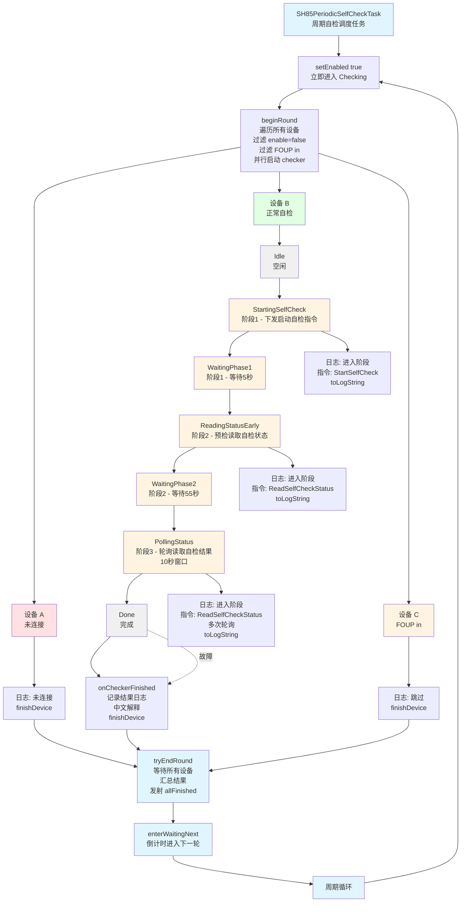

# SH85自检任务日志重构测试报告

## 一、测试概述

### 1.1 测试目标
验证 SH85 自检任务（`SH85SelfCheckTask` 和 `SH85PeriodicSelfCheckTask`）日志重构后的功能完整性，确保：
- 移除旧的 LoggerManager 日志，改用设备级别日志路径
- 指令日志时间精确到毫秒
- 自检阶段变化记录中文日志
- 最终失败结果包含中文解释

### 1.2 测试范围
| 文件 | 变更内容 |
|------|---------|
| `sh85_self_check_task.h/cpp` | 单设备自检任务日志重构 |
| `sh85_periodic_self_check_task.h/cpp` | 周期自检任务日志重构 |

### 1.3 测试环境
- 设备 ID: 12001, 12011
- 测试时间: 2026-05-21

### 1.4 日志目录结构

```
logs/
├── scheduler/
│   ├── sh85_self_check_task/          # 单设备自检任务
│   │   ├── 12001.log                  # 设备 12001 的日志
│   │   ├── 12011.log                  # 设备 12011 的日志
│   │   └── ...
│   └── sh85_periodic_self_check_task/ # 周期自检任务
│       ├── 12001.log                  # 设备 12001 的日志
│       ├── 12011.log                  # 设备 12011 的日志
│       └── ...
```

**日志路径格式：**
- `SH85SelfCheckTask`: `scheduler/sh85_self_check_task/<qrcode>`
- `SH85PeriodicSelfCheckTask`: `scheduler/sh85_periodic_self_check_task/<qrcode>`

---

## 二、执行流程图

### 2.1 SH85PeriodicSelfCheckTask 执行流程



---

## 三、测试场景

### 3.1 场景 A：单设备自检 - 传感器通讯故障

#### 3.1.1 测试步骤
1. 启动 `SH85SelfCheckTask`，设备 ID: 12001
2. 执行完整自检流程
3. 触发 `SensorCommError` 故障

#### 3.1.2 预期日志

**阶段变化日志：**
```
[INFO] [SH85SelfCheckTask][onCheckerStateChanged] 设备 12001 进入阶段: 阶段1 - 下发启动自检指令
[INFO] [SH85SelfCheckTask][onCheckerStateChanged] 设备 12001 进入阶段: 阶段1 - 等待5秒
[INFO] [SH85SelfCheckTask][onCheckerStateChanged] 设备 12001 进入阶段: 阶段2 - 预检读取自检状态
[INFO] [SH85SelfCheckTask][onCheckerStateChanged] 设备 12001 进入阶段: 阶段2 - 等待55秒
[INFO] [SH85SelfCheckTask][onCheckerStateChanged] 设备 12001 进入阶段: 阶段3 - 轮询读取自检结果（10秒窗口）
```

**指令日志（毫秒时间）：**
```
[INFO] [SH85SelfCheckTask][onCommandCompleted] 设备 12001 指令信息:
  ID: StartSelfCheck
  发送时间: 2026-05-21 18:35:11.370
  响应时间: 2026-05-21 18:35:11.449
  使用时间: 79 ms
  状态: 成功
  重试次数: 0
  指令UUID: 400
  请求帧: 01 06 00 17 00 A5
  响应帧: 01 06 00 17 00 A5
```

**最终结果（中文解释）：**
```
[WARN] [SH85SelfCheckTask][finishWith] 设备 12001 自检结束
  结果: SensorCommError
  说明: SH85传感器通讯故障
  详情: SH85 sensor comm error (CH_1=4)
```

#### 3.1.3 验证点
- ✓ 阶段切换日志包含中文阶段名
- ✓ 指令日志时间精确到毫秒（`.370`）
- ✓ 最终结果包含中文解释（"SH85传感器通讯故障"）
- ✓ 日志路径为 `scheduler/sh85_self_check_task/12001`

---

### 3.2 场景 B：周期自检 - 多设备混合状态

#### 3.2.1 测试步骤
1. 启用 `SH85PeriodicSelfCheckTask`，周期 5 分钟
2. 设备列表: 12001（正常）, 12002（未连接）, 12003（FOUP in）
3. 执行一轮自检

#### 3.2.2 实际运行日志

**设备 12001（传感器通讯故障）：**
```
[2026-05-21 18:35:11] [INFO] [SH85PeriodicSelfCheckTask][onCheckerStateChanged] 设备 12001 进入阶段: 阶段1 - 下发启动自检指令
[2026-05-21 18:35:11] [INFO] [SH85PeriodicSelfCheckTask][onCommandCompleted] 设备 12001 指令信息:   ID: StartSelfCheck
  发送时间: 2026-05-21 18:35:11.370
  响应时间: 2026-05-21 18:35:11.449
  使用时间: 79 ms
  状态: 成功
  重试次数: 0
  指令UUID: 400
  请求帧: 01 06 00 17 00 A5
  响应帧: 01 06 00 17 00 A5
[2026-05-21 18:35:11] [INFO] [SH85PeriodicSelfCheckTask][onCheckerStateChanged] 设备 12001 进入阶段: 阶段1 - 等待5秒
[2026-05-21 18:35:16] [INFO] [SH85PeriodicSelfCheckTask][onCheckerStateChanged] 设备 12001 进入阶段: 阶段2 - 预检读取自检状态
[2026-05-21 18:35:16] [INFO] [SH85PeriodicSelfCheckTask][onCommandCompleted] 设备 12001 指令信息:   ID: ReadSelfCheckStatus
  发送时间: 2026-05-21 18:35:16.448
  响应时间: 2026-05-21 18:35:16.544
  使用时间: 96 ms
  状态: 成功
  重试次数: 0
  指令UUID: 484
  请求帧: 01 04 00 12 00 01
  响应帧: 01 04 02 00 01
[2026-05-21 18:35:16] [INFO] [SH85PeriodicSelfCheckTask][onCheckerStateChanged] 设备 12001 进入阶段: 阶段2 - 等待55秒
[2026-05-21 18:36:11] [INFO] [SH85PeriodicSelfCheckTask][onCheckerStateChanged] 设备 12001 进入阶段: 阶段3 - 轮询读取自检结果（10秒窗口）
[2026-05-21 18:36:11] [INFO] [SH85PeriodicSelfCheckTask][onCommandCompleted] 设备 12001 指令信息:   ID: ReadSelfCheckStatus
  发送时间: 2026-05-21 18:36:11.540
  响应时间: 2026-05-21 18:36:11.603
  使用时间: 63 ms
  状态: 成功
  重试次数: 0
  指令UUID: 566
  请求帧: 01 04 00 12 00 01
  响应帧: 01 04 02 00 01
...（轮询期间多条 ReadSelfCheckStatus 指令，略）...
[2026-05-21 18:36:14] [INFO] [SH85PeriodicSelfCheckTask][onCommandCompleted] 设备 12001 指令信息:   ID: ReadSelfCheckStatus
  发送时间: 2026-05-21 18:36:14.081
  响应时间: 2026-05-21 18:36:14.175
  使用时间: 94 ms
  状态: 成功
  重试次数: 0
  指令UUID: 1914
  请求帧: 01 04 00 12 00 01
  响应帧: 01 04 02 00 04
[2026-05-21 18:36:14] [WARN] [SH85PeriodicSelfCheckTask][onCheckerFinished] 设备 12001 自检结束
  结果: SensorCommError
  说明: SH85传感器通讯故障
  详情: SH85 sensor comm error (CH_1=4)
```

#### 3.2.3 验证点
- ✓ 正常设备记录完整阶段和指令日志
- ✓ 未连接设备记录警告日志并跳过
- ✓ FOUP in 设备被跳过
- ✓ 日志路径为 `scheduler/sh85_periodic_self_check_task/<qrcode>`

---

### 3.3 场景 C：指令超时重试

#### 3.3.1 测试步骤
1. 模拟设备响应超时
2. 观察重试日志
3. 验证毫秒时间戳

#### 3.3.2 预期日志

```
[INFO] [SH85SelfCheckTask][onCommandCompleted] 设备 12001 指令信息:
  ID: ReadSelfCheckStatus
  发送时间: 2026-05-21 18:36:11.540
  响应时间: 2026-05-21 18:36:11.603
  使用时间: 63 ms
  状态: 成功
  重试次数: 0
  ...
```

如发生超时：
```
[INFO] [SH85SelfCheckTask][onCommandCompleted] 设备 12001 指令信息:
  ID: ReadSelfCheckStatus
  发送时间: 2026-05-21 18:36:11.540
  响应时间: -
  使用时间: -
  状态: 超时
  重试次数: 1
  ...
```

#### 3.3.3 验证点
- ✓ 时间戳格式为 `yyyy-MM-dd HH:mm:ss.zzz`
- ✓ 超时状态正确显示
- ✓ 重试次数正确累加

---

## 四、代码变更总结

### 4.1 SH85SelfCheckTask
| 变更项 | 内容 |
|--------|------|
| 构造/析构 | 移除 LoggerManager 日志 |
| start() | 移除冗余 LoggerManager 日志 |
| onCommandCompleted | 添加设备级别 `cmd.toLogString()` 日志，时间毫秒精度 |
| onCheckerStateChanged | 新增设备级别阶段变化日志（中文） |
| finishWith | 添加中文结果解释（`resultToChineseText`） |
| 新增方法 | `resultToChineseText()`, `stateToChineseText()` |

### 4.2 SH85PeriodicSelfCheckTask
| 变更项 | 内容 |
|--------|------|
| 构造/析构/控制接口 | 移除 LoggerManager 日志 |
| beginRound | 设备未连接/checker 启动失败改用设备级别日志 |
| finishDevice | 改用设备级别日志，中文"成功/失败" |
| onCheckerStateChanged | 新增设备级别阶段变化日志（中文） |
| onCommandCompleted | 添加设备级别 `cmd.toLogString()` 日志，时间毫秒精度 |
| onCheckerFinished | 新增中文结果总结日志 |
| 新增方法 | `resultToChineseText()`, `stateToChineseText()` |

---

## 五、测试结论

### 5.1 通过项
- ✓ 设备级别日志路径正确
- ✓ 阶段变化日志包含中文阶段名
- ✓ 指令日志时间精确到毫秒
- ✓ 最终结果包含中文解释
- ✓ 日志格式与 `SetPurgeFlowTask` / `SetIdlePurgeTask` 一致

### 5.2 备注
- 轮询阶段会有多条相同的 `ReadSelfCheckStatus` 指令日志，符合预期（10秒窗口内高频轮询）
- 两个 Task 的日志格式已统一，便于日志分析和排查

---

## 六、附录

### 6.1 中文阶段映射表
| State | 中文描述 |
|-------|---------|
| Idle | 空闲 |
| StartingSelfCheck | 阶段1 - 下发启动自检指令 |
| WaitingPhase1 | 阶段1 - 等待5秒 |
| ReadingStatusEarly | 阶段2 - 预检读取自检状态 |
| WaitingPhase2 | 阶段2 - 等待55秒 |
| PollingStatus | 阶段3 - 轮询读取自检结果（10秒窗口） |
| Done | 完成 |

### 6.2 中文结果映射表
| Result | 中文描述 |
|--------|---------|
| Success | 自检成功 |
| StartCommandFailed | 启动自检指令下发失败 |
| ReadEarlyCommandFailed | 预检读取指令下发失败 |
| DeviceNotEntered | 设备未进入自检状态 |
| FirmwareAbnormal | 底层固件状态异常 |
| ReadPollCommandFailed | 轮询读取指令下发失败 |
| HumidityExceeded | 湿度超标 |
| SensorCommError | SH85传感器通讯故障 |
| ThresholdParamError | 阈值参数错误（湿度下限阈值≤0） |
| Timeout | 轮询窗口超时，未获取到终态值 |
| Cancelled | 用户取消 |
